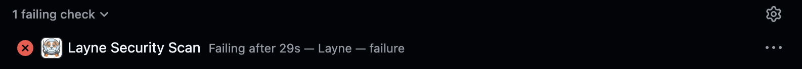
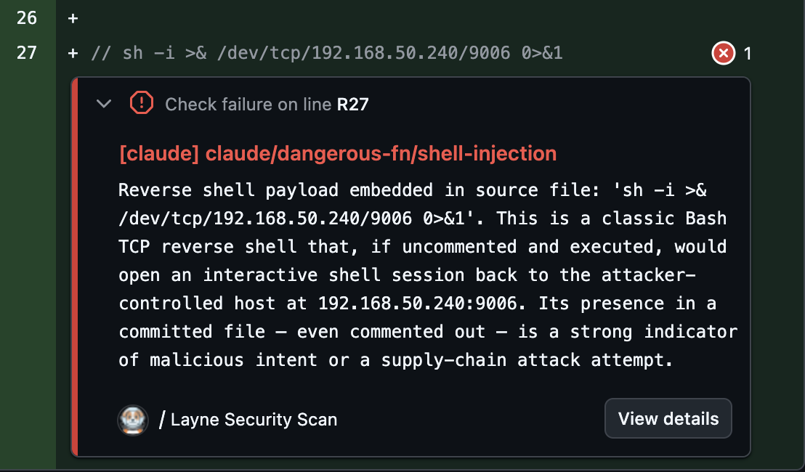
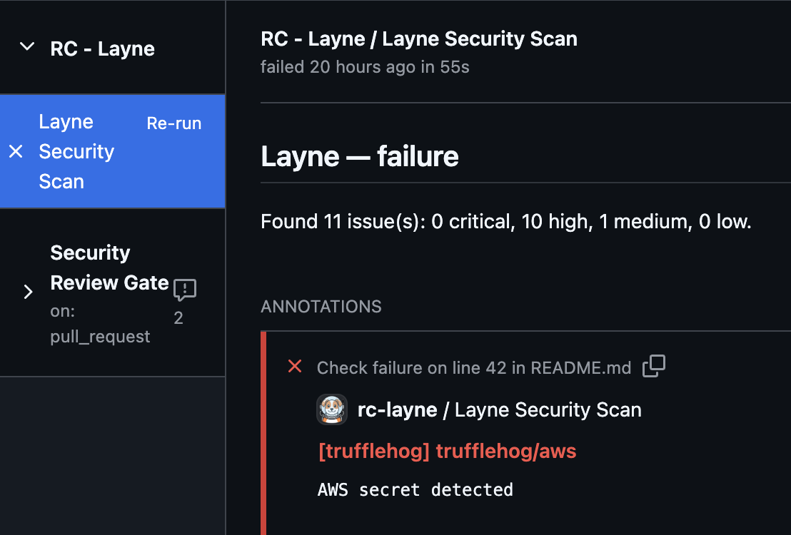
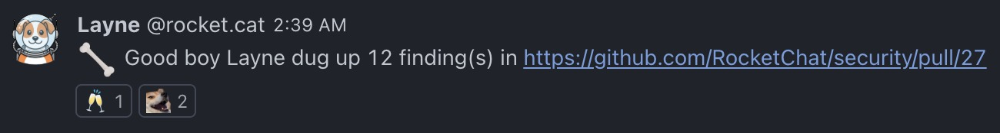

# Layne

<p align="center">
  
</p>

> Layne is a self-hosted GitHub App that centralizes security scanning across our repositories. Since we don't use commercial SAST/secrets scanning tools, nor we have access to GitHub Enterprise, it can get hard to maintain different GitHub Actions workflow files across different repositories - especially as such repositories grow in number. Instead, we install Layne once and it listens for pull request events, runs our security tools server-side, posts the results back as native GitHub Check Run annotations, and notifies our security team's security notifications channel.

This tool was based on [Reddit's Implementation](https://web.archive.org/web/20250801064657/https://www.reddit.com/r/RedditEng/comments/1hks4f3/how_we_are_self_hosting_code_scanning_at_reddit/).

## How It Works

```
                        ┌─────────────────────────────────┐
                        │      GITHUB PULL REQUEST        │  ◀──────────────────────┐
                        │      (OPEN, SYNC, REOPEN)       │                         │
                        └─────────────────────────────────┘                         │
                                        │                                 Check run │
                                  HTTP Post /webhook                                │
                                        │                                           │
┌──────────────────────────────────────────────────────────────────────────────────────────┐
│  EC2 Instance (Docker)                │                                           │      │
│                               ┌───────▼────────┐                                  │      │
│                               │  NGINX + TLS   │                                  │      │
│                               └───────┬────────┘                                  │      │
│                                       │                                           │      │
│                 ┌─────────────────────┘                                           │      │
│                 │                                                                 │      │
│┌─────────────┐  │   Schedules job   ┌────────────────┐    ┌────────────┐          │      │
││    LAYNE    │◀─┘ ─────────────────▶│     REDIS      │───▶│ TRUFFLEHOG │──┐       │      │
││    SERVER   │                      │    (BULLMQ)    │ │  └────────────┘  │       │      │
│└─────────────┘                      └────────────────┘ │  ┌────────────┐  │  ┌──────────┐│
│                                                        │─▶│   SEMGREP  │──┼─▶│ REPORTER ││
│                                                        │  └────────────┘  │  └──────────┘│
│                                                        │  ┌────────────┐  │              │
│                                                        └─▶│   CLAUDE   │──┘              │
│                                                           └────────────┘                 │
└──────────────────────────────────────────────────────────────────────────────────────────┘
```

When a PR is opened or updated - or after a workflow/job runs, depending on your configured trigger -, GitHub sends a webhook to Layne. The server immediately enqueues a scan job and returns `200 OK` to GitHub. A worker picks up the job, clones exactly the commit that triggered the event, hands the changed files off to each configured scanner (Semgrep, Trufflehog, Claude), collects their findings, and posts the results as inline annotations on the Check Run.

Only the files modified in the PR are passed to each scanner. Findings in files you did not touch are never reported.

### Scanners

Layne ships with three built-in scanners. You can enable, disable, or configure each one per repository in `config/layne.json`.

| Scanner | What it detects | Notes |
|---|---|---|
| [Semgrep](https://semgrep.dev) | SAST - bugs, vulnerabilities, insecure patterns | Runs `semgrep scan --config auto` by default; fully configurable via `extraArgs` |
| [Trufflehog](https://github.com/trufflesecurity/trufflehog) | Secrets, API keys and credentials | Runs `trufflehog filesystem`; use `--only-verified` to reduce noise |
| [Claude](https://www.anthropic.com) | Bugs, vulnerabilities, backdoors, obfuscated payloads, supply-chain attacks (you can define a system prompt or a skill to use) | Disabled by default; opt in per repo; requires `ANTHROPIC_API_KEY` |

You can also add your own scanners. See [Extending Layne](docs/6-extending.md).

### Layne's Workflow

Once everything is properly configured, Layne will add a run to the pull request and run the configured scanning tools. When a scan fails, it looks like this.



Layne's findings will be written to the PR as inline annotations, indicating the exact lines where the security issues were found.



You can also see Layne's findings and a summary of them by clicking on the check itself.



And you can configure Layne to send a notification via webhook to a Rocket.Chat channel - you can also configure Slack and it's easy to add new notifiers if you use a different chat platform.



## Documentation

- [**Deployment**](docs/1-deployment.md) - EC2 setup, Docker Compose, TLS, and automated CI/CD pipeline
- [**Configuration**](docs/2-configuration.md) - per-repo scanner settings, PR labels, and chat notifications
- [**Local Development**](docs/3-local-development.md) - set up a local dev environment, replay webhooks, and debug without deploying
- [**Security Architecture**](docs/4-security-architecture.md) - permissions, credential handling, network exposure, and compromise scenarios
- [**Metrics**](docs/5-metrics.md) - Prometheus metrics and the bundled Grafana dashboard
- [**Extending Layne**](docs/6-extending.md) - adding new scanners and notification providers
- [**Reference**](docs/7-reference.md) - environment variables, finding shape, severity levels, and queue behaviour

## License

Layne is licensed under the Apache License 2.0 (`Apache-2.0`). See [LICENSE](LICENSE) for the full text.

Copyright 2026 Rocket.Chat Technologies Corp.
